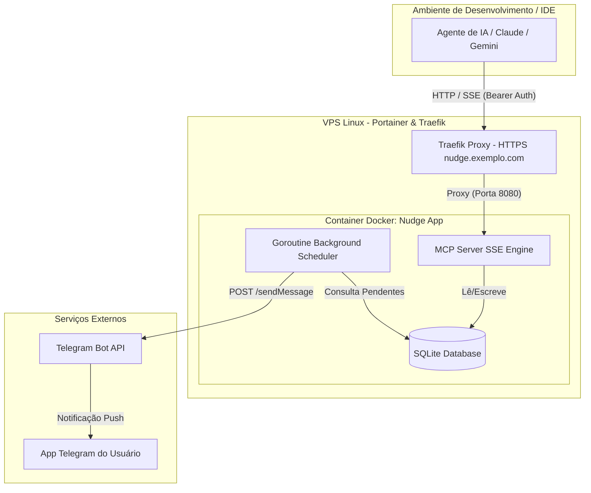

# Nudge - Especificação de Design de Arquitetura

**Data:** 2026-07-25  
**Domínio:** `nudge.exemplo.com`  
**Stack:** Go (Golang) + SQLite + Docker + Traefik  
**Interface:** MCP (Model Context Protocol) via SSE (Server-Sent Events)  
**Notificações:** Telegram Bot API  

---

## 1. Visão Geral do Projeto

O **Nudge** é um sistema leve de gerenciamento e disparo de lembretes em nuvem, projetado especificamente para ser consumido por **Agentes de Inteligência Artificial** através do protocolo **MCP (Model Context Protocol)** durante sessões de codificação e desenvolvimento.

Quando um usuário solicita um lembrete (ex: *"me avise quando o teste terminar"*, *"me lembre amanhã às 9h de testar X"*, ou *"me lembre toda segunda de checar os créditos"*), a IA interage com o servidor Nudge via MCP. No momento apropriado, o Nudge dispara uma notificação direta para o dispositivo do usuário através de um **Bot do Telegram**.

---

## 2. Requisitos & Casos de Uso

### 2.1 Tipos de Lembrete Suportados
1. **Instantâneo (`instant`):** Disparado imediatamente quando a IA chama a tool (ex: "aviso de fim de tarefa/build").
2. **Agendado (`scheduled`):** Disparado em uma data e hora específicas no futuro (ex: ISO timestamp). Se o usuário não disser o horário, a IA pergunta antes de chamar a tool.
3. **Recorrente (`recurring`):** Disparado periodicamente com base em uma regra cron ou padrão de intervalo (ex: `@daily`, `0 9 * * 1`).

### 2.2 Requisitos Não-Funcionais
* **Consumo Mínimo de Recursos:** Baixíssimo uso de RAM (~10MB-15MB) e CPU na VPS.
* **Sem dependências locais:** Todo o desenvolvimento local é isolado em Docker (sem necessidade de Go instalado na máquina host).
* **Segurança:** Autenticação via `Bearer Token` no endpoint SSE do MCP.
* **Infraestrutura Existente:** Integração com Traefik (para SSL/TLS automático) e Portainer na VPS.

---

## 3. Arquitetura da Solução



---

## 4. Modelagem do Banco de Dados (SQLite)

O banco de dados SQLite será gerenciado de forma embarcada (utilizando o driver pure-Go `modernc.org/sqlite` para eliminar necessidade de CGO).

### Tabela `reminders`

```sql
CREATE TABLE IF NOT EXISTS reminders (
    id TEXT PRIMARY KEY,
    message TEXT NOT NULL,
    type TEXT CHECK(type IN ('instant', 'scheduled', 'recurring')) NOT NULL,
    scheduled_at DATETIME NULL,
    cron_pattern TEXT NULL,
    status TEXT CHECK(status IN ('pending', 'sent', 'cancelled')) NOT NULL DEFAULT 'pending',
    created_at DATETIME NOT NULL DEFAULT CURRENT_TIMESTAMP,
    updated_at DATETIME NOT NULL DEFAULT CURRENT_TIMESTAMP
);

CREATE INDEX IF NOT EXISTS idx_reminders_status_scheduled ON reminders(status, scheduled_at);
```

---

## 5. Especificação da Interface MCP (Tools)

O servidor Nudge expõe as seguintes ferramentas (tools) MCP para o agente de IA:

### 5.1 `create_reminder`
Cria e registra um novo lembrete.

* **Parâmetros:**
  * `message` (string, obrigatório): Conteúdo do lembrete.
  * `type` (string, obrigatório): `"instant"`, `"scheduled"`, ou `"recurring"`.
  * `scheduled_at` (string, opcional): Data/hora no formato ISO-8601 (ex: `2026-07-26T09:00:00Z`). Obrigatório para `type="scheduled"`.
  * `cron_pattern` (string, opcional): Expressão cron ou apelido (ex: `0 9 * * 1` ou `@daily`). Obrigatório para `type="recurring"`.

### 5.2 `list_reminders`
Lista lembretes pendentes ou agendados.

* **Parâmetros:**
  * `status` (string, opcional): Filtrar por `"pending"`, `"sent"`, ou `"all"`. Padrão: `"pending"`.

### 5.3 `cancel_reminder`
Cancela um lembrete pendente.

* **Parâmetros:**
  * `id` (string, obrigatório): ID do lembrete a ser cancelado.

---

## 6. Fluxo do Agendador & Disparador Telegram

1. **Goroutine Ticker:** Um loop roda a cada 15 segundos verificando o SQLite.
2. **Seleção de Pendentes:**
   ```sql
   SELECT * FROM reminders 
   WHERE status = 'pending' 
     AND (scheduled_at IS NULL OR scheduled_at <= CURRENT_TIMESTAMP);
   ```
3. **Disparo Telegram:**
   Para cada registro encontrado:
   * Realiza requisição HTTP `POST https://api.telegram.org/bot<TELEGRAM_BOT_TOKEN>/sendMessage` com o `chat_id` e a mensagem formatada.
   * Em caso de sucesso em lembrete `scheduled` ou `instant`: atualiza `status = 'sent'`.
   * Em caso de lembrete `recurring`: calcula o próximo `scheduled_at` com base no `cron_pattern` e mantém `status = 'pending'`.

---

## 7. Infraestrutura & Deployment

### 7.1 Docker & Traefik (`docker-compose.yml`)

```yaml
version: '3.8'

services:
  nudge:
    image: ghcr.io/leomaciel/nudge:latest
    container_name: nudge
    restart: unless-stopped
    environment:
      - PORT=8080
      - MCP_AUTH_TOKEN=${MCP_AUTH_TOKEN}
      - TELEGRAM_BOT_TOKEN=${TELEGRAM_BOT_TOKEN}
      - TELEGRAM_CHAT_ID=${TELEGRAM_CHAT_ID}
      - DATABASE_URL=/data/nudge.db
    volumes:
      - nudge-data:/data
    networks:
      - traefik-net
    labels:
      - "traefik.enable=true"
      - "traefik.http.routers.nudge.rule=Host(`nudge.exemplo.com`)"
      - "traefik.http.routers.nudge.entrypoints=websecure"
      - "traefik.http.routers.nudge.tls.certresolver=letsencrypt"
      - "traefik.http.services.nudge.loadbalancer.server.port=8080"

volumes:
  nudge-data:

networks:
  traefik-net:
    external: true
```

### 7.2 CI/CD com GitHub Actions (`.github/workflows/deploy.yml`)
1. Disparado ao realizar `git push origin main`.
2. Builda a imagem Docker com tag `ghcr.io/leomaciel/nudge:latest`.
3. Faz push para o GitHub Container Registry (GHCR).
4. Conecta na VPS via SSH e executa `docker compose pull && docker compose up -d`.

---

## 8. Próximos Passos
1. Aprovação do Documento de Especificação pelo usuário.
2. Criação do Plano de Implementação detalhado (`implementation_plan.md`).
3. Inicialização dos arquivos de configuração Docker, Go module e CI/CD.
